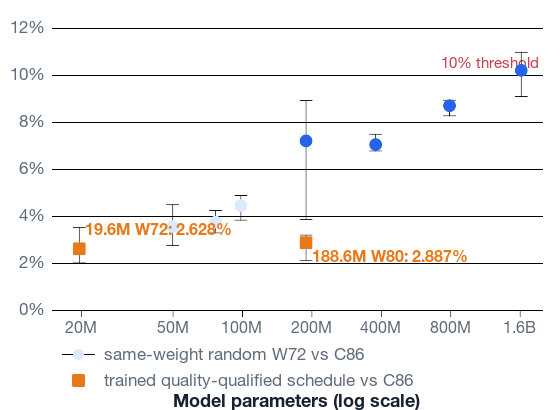
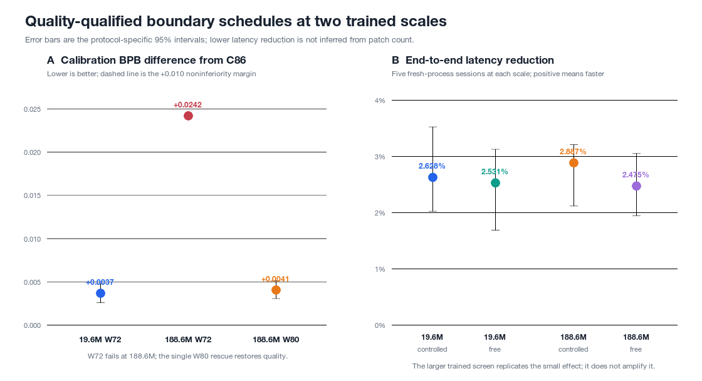

# Abstract

Byte-latent language models amortize global Transformer compute by grouping raw
bytes into patches, but fewer patches need not preserve quality or reduce
end-to-end latency. We test causal whitespace-informed patching on Korean in an
identical byte-latent graph, separating boundary placement, patch rate, learned
router cost, and cached autoregressive time-to-output. Calibration-only
selection chose a 72-patch whitespace policy (W72). On a separately sealed
32MB final stream and five model seeds, W72 was noninferior to an 86-patch
codepoint baseline at +0.003682 bits per byte and improved on the same-rate
codepoint policy by 0.010781. Five fresh-process Apple-MPS sessions measured
2.628% controlled and 2.531% free-running latency reductions, but failed a
predefined 10% efficiency threshold. A post-result random-weight curve rose
from 3.572% at 49.8M parameters to 10.217% at 1.618B, exposing systems
headroom without trained quality evidence. At 188.6M, unchanged W72 failed
quality; one presealed W80 rescue restored noninferiority and reproduced only
2.887% controlled and 2.475% free-running reductions. Thus the small effect
replicates across two trained scales but does not amplify. Quality-constrained
patch density and an unchanged byte-sequential local path prevent random-weight
headroom from becoming an automatic trained-model speedup.

# 1. Introduction

Subword tokenization makes language modeling computationally tractable by
shortening sequences, but fixes a vocabulary and a segmentation algorithm
outside the model. Recent tokenizer-free systems instead process bytes and
compress them inside the network. Byte Latent Transformer (BLT), for example,
maps local byte representations into variable-length patches before an
expensive global trunk [@pagnoni-etal-2025-byte]. H-Net learns hierarchical
chunks end to end [@hwang-etal-2025-hnet], while SpaceByte places large blocks
after a deterministic class of "spacelike" bytes [@slagle2024spacebyte].

These systems expose a basic design question: where should expensive global
computation occur? A learned boundary predictor can use context-sensitive
uncertainty, but its parameters and full-byte forward pass are not free. A
deterministic orthographic rule has little state and no learned parameters, but
cheap detection does not imply a useful information boundary. Earlier work has
compared learned, entropy-supervised, tokenizer-supervised, and linguistically
motivated pooling [@nawrot-etal-2023-efficient], and word-boundary pooling can
support parallel local reconstruction [@thawani-etal-2023-learn]. It is
therefore insufficient to claim novelty from using linguistic rules alone.

Korean is an informative controlled setting. Modern Korean text is usually
stored as precomposed Hangul syllables, each typically encoded by three UTF-8
bytes. Spaces delimit eojeol, which are larger than English-style words and can
contain several morphemes [@moon-etal-2022-openkorpos]. Korean morphology-aware
tokenizers can improve downstream models [@park-etal-2020-empirical;
@lee-etal-2026-morpheme], but those results do not establish where a
tokenizer-free model should allocate global computation. They also do not
separate boundary placement from compression rate and detector cost.

We study the following question:

> At the same global-position rate, does relocating a causal byte-patch
> boundary toward already observed Korean whitespace improve modeling quality
> over generic codepoint alignment? If so, does this parameter-free policy
> remain on the quality--cost frontier after the full cost of learned entropy
> routing is included?

Our study makes five methodological contributions; later scale extensions are
reported as post-result tests rather than folded into the original
confirmatory claim:

1. We define fixed-byte, generic codepoint, whitespace-conditioned, authentic
   SpaceByte, and learned entropy patch policies in one causal BLT graph.
2. We separate a same-rate boundary-quality experiment from a realized-rate
   Pareto experiment, preventing a boundary policy from winning merely by using
   more global positions.
3. We distinguish router inference, selector construction, batch padding,
   parameter memory, synchronized teacher-forced timing, and exact cached
   time-to-output, and do not promote an incomplete teacher-forced Pareto table
   into an inference claim.
4. We reconstruct policy-selection scores directly from checkpoints using
   calibration data only, bind logical roles to exact five-seed physical-model
   bundles, and evaluate final quality with paired seeds and source-document
   clusters on a separately sealed stream.
5. We disclose the exposed development screens and their chronology, then
   prospectively Git-seal the final-quality and actual-inference rules before
   their respective model losses or timings are observed. Tracked v5/v5r1
   failures discovered before any timing artifact was published led to v5r2's
   intersection of the original CPU semantic oracle with an MPS logit-safety,
   probability-distribution, and exact-greedy contract; pair, cases, workload,
   statistic, and efficiency threshold remain fixed. We do not describe this
   local Git evidence as public preregistration or cryptographic one-shot
   enforcement.

The compact quality result establishes a replicated same-rate boundary-
placement effect. Its matched-quality systems test found a stable 2.5--2.6%
latency reduction. Random-weight headroom later crossed 10% at 1.618B, but an
188.6M trained quality-rescue replication again measured only 2.5--2.9% and
failed its fixed scale-amplification criterion. We therefore separate a real,
small boundary-schedule effect from the unsupported claim that parameter scale
automatically magnifies it.

# 2. Background and Related Work

## 2.1 Byte-level latent computation

BLT uses local byte encoder/decoder modules around a patch-level global
Transformer. Its principal dynamic policy places boundaries at next-byte
entropy spikes and was validated in a FLOP-controlled study up to 8B parameters
and 4T training bytes [@pagnoni-etal-2025-byte]. SpaceByte instead invokes large
blocks after a deterministic spacelike predicate and reports competitive
compute-controlled language modeling [@slagle2024spacebyte]. For multibyte
scripts, a UTF-8 lead byte satisfies that predicate, so its cadence is not
equivalent to whitespace-only segmentation.

AU-Net is an even closer precedent for deterministic boundary hierarchies. It
pools raw bytes first at regex-detected word boundaries and then over groups of
two and four words, so deeper autoregressive stages are activated less often
[@videau-etal-2025-aunet]. The paper reports compute-controlled quality and GPU
throughput, and explicitly leaves delimiterless languages for future work. It
therefore rules out novelty from a rule-defined hierarchy or sparse high-level
activation itself. Our narrower question concerns Korean observed spacing and
generic codepoint events at an exactly matched global-position rate, with
detector-inclusive, matched-output generation latency; we do not introduce a
new hierarchical template.

H-Net learns content- and context-dependent chunks jointly with the language
model [@hwang-etal-2025-hnet]. FLEXITOKENS relaxes fixed-rate boundary training
for adaptation across domains and languages [@owodunni-etal-2026-flexitokens].
Scratchpad Patching shows that patch lag and compute allocation can matter as
much as the outer boundary rule: transient within-patch states substantially
improve simple patchers [@zheng-etal-2026-scratchpad]. Accordingly, our
same-graph comparison does not support claims about learned routing in general,
H-Net, or scratchpad-augmented architectures.

ByteFlow learns compression-driven byte importance and retains a static graph
through Top-K selection, reporting strong quality relative to BPE and earlier
byte models [@deng-etal-2026-byteflow]. Its teacher-forced selector ranks a
full-sequence importance profile: even if individual scores use causal
features, membership in the global Top-K can depend on suffix scores. Its
reported efficiency evidence is training throughput and analytical cost rather
than a demonstrated prefix-causal cached autoregressive runtime. We therefore
treat ByteFlow as strong adaptive-compression related work, not as evidence
that the same boundary procedure can be executed incrementally at the reported
cost.

Bolmo takes a different route to scale: it converts pretrained subword models
into byte-level latent-tokenizer models with less than 1% of a typical
pretraining budget. Its boundary predictor uses one byte of lookahead during
prefill and its decoder predicts bytes and subsequent boundaries jointly
[@minixhofer-etal-2025-bolmo]. This makes Bolmo a strong system-level reference,
but not a prefix-causal, from-scratch, same-graph boundary ablation. H-Net++
reports learned morphological alignment on Persian with bidirectional routing,
while Adaptive Targeted Dynamic Chunking schedules H-Net's target compression
during training [@zakershahrak-ghodratnama-2025-hnetpp;
@dang-etal-2026-atdc]. These preprints address morphology-aware learned
chunking and rate optimization, respectively, rather than the value of an
observed Korean spacing event at an exactly fixed rate.

Dynamic Token Pooling directly compared learned and linguistically motivated
boundary signals in character-level hierarchical Transformers
[@nawrot-etal-2023-efficient]. Learn Your Tokens pools bytes or characters at
word boundaries and decodes local symbols in parallel
[@thawani-etal-2023-learn]. These works preclude a "first linguistic boundary"
claim. Our narrower intervention is a prefix-causal relocation rule under an
exact global-position budget, paired with detector-inclusive cost accounting.

Dynamic tokenization has also been retrofitted into pretrained models using a
hypernetwork to embed batch-specific merged subwords. In decoder-only models,
the genuinely dynamic variant applies to scoring and prefill, where the full
sequence is known; its autoregressive extension instead uses a bounded static
one-million-token vocabulary [@feher-etal-2025-retrofitting]. The reported
multilingual encoder suite does not include Korean. This work rules out novelty
from dynamic boundaries or on-the-fly embeddings alone, but does not evaluate a
prefix-causal byte-patch schedule during cached generation.

zip2zip extends online adaptation to autoregressive output: an LZW codebook
creates reusable hypertokens and learned hyper-embedding modules let one model
step emit multiple base tokens [@geng-etal-2025-zip2zip]. It reports real M1 and
H100 throughput gains, but also higher byte perplexity and severe GSM8K
degradation. Its latency table measures tokens per second for a fixed 256-token
generation but does not establish that base and hypertoken runs stop at the same
decompressed byte length. We therefore treat it as the strongest online
multi-unit-generation reference, while using time to the same number of source
UTF-8 bytes for cross-tokenizer comparisons. Its released revision does not
expose the paper's MLX/Table-5 benchmark path, so we do not reinterpret the
published percentages as matched-output latency.

SemToken reports semantic-density-based input compression and long-context
latency improvements [@liu-yu-2026-semtoken]. Its currently released benchmark
times token compression over mock strings, leaves model-quality fields empty,
and does not execute the LLaMA/GPT-J/GPT-NeoX models named by the runner. We cite
the peer-reviewed proposal but do not use its reported systems numbers as a
reproduced comparator.

Hierarchical BPE is a particularly close low-cost alternative. It derives
character patches from an existing BPE tokenizer, adds explicit patch-end
markers, and applies a second BPE stage to control granularity; in its reported
settings it matches or exceeds entropy- and whitespace-based patching without
an auxiliary boundary model [@dolga-etal-2025-characters]. Unlike our policy,
it changes the encoding pipeline and requires a learned vocabulary, but it
precludes any claim that W versus one entropy router exhausts cheap grouping
methods.

A contemporaneous position paper proposes explicitly disentangling a byte
model's next-byte and boundary distributions, including self-distilling the
former while retraining the latter [@haltiuk-2026-disentangling]. It lays out
the boundary-transfer experiment but does not report its completion. Our
separately trained policy comparison does not test post-hoc disentanglement;
instead, it measures whether boundary schedules are performance-neutral under
controlled Korean pretraining.

Fast BLT tackles a different bottleneck: byte-by-byte output generation. It
introduces block diffusion and speculative variants that generate multiple
bytes per expensive step [@kallini-etal-2026-fast]. Its reported generation
savings are estimates of memory-bandwidth cost rather than measurements of
matched-output wall-clock latency. We therefore neither import those percentages
as runtime evidence nor conflate fewer global positions during teacher-forced
scoring with fewer autoregressive output steps.

Generic multi-byte drafting is itself well established. Multi-token Prediction
adds independent future heads and demonstrates byte-level self-speculative
decoding [@gloeckle-etal-2024-mtp], while Medusa constructs and verifies trees
from multiple decoding heads [@cai-etal-2024-medusa]. MtPC directly addresses
the unrealistic independence of future-byte heads with probabilistic circuits,
retrofitting EvaByte and a byteified Llama and preserving the verifier through
speculative decoding [@grivas-etal-2026-mtpc]. MtPC evaluates English only and
leaves multilingual throughput open, but it precludes novelty claims for either
factorized or dependence-aware byte MTP alone. Any Korean follow-up must compare
an orthography-aware draft against a same-cost generic byte-MTP control and show
an additional measured advantage.

## 2.2 Korean representation and tokenization

Korean syllables can be factored into small initial, medial, and final Jamo
sets. Three-hot character modeling retains one syllable timestep while reducing
embedding parameters by 99.6% relative to a full syllable vocabulary, without a
translation-quality loss in the reported setting [@cognetta-etal-2023-parameter].
Jamo-based subword tokenization has also helped low-resource, restricted-
vocabulary Korean translation [@lee-etal-2025-jamo], and SCRIPT injects Jamo
composition into pretrained subword embeddings [@kim-etal-2026-script].

These are representation interventions. Our models retain the source NFC UTF-8
bytes, the byte vocabulary, and the byte-level loss. We change only patch
starts. A positive result would therefore not demonstrate that Jamo
factorization is superior.

Korean tokenization studies provide a second, distinct line of work.
Morphological analysis followed by BPE performs well across several Korean
tasks, with task-dependent exceptions [@park-etal-2020-empirical]. Morpheme
Matters constructs inter- and intra-eojeol subwords and reports both task gains
and shorter token sequences [@lee-etal-2026-morpheme]. OpenKorPOS emphasizes
that Korean spaces delimit units larger than English words and that conventional
morphological outputs can lose spacing and normalization information needed for
generation [@moon-etal-2022-openkorpos]. Our whitespace policy is not a
morphological tokenizer: it uses no analyzer, label, vocabulary merge, or
future context.

Korean over-segmentation has also been addressed by adding longer lexical items
to a BPE vocabulary [@lee-etal-2024-length]. More broadly, MYTE changes the byte
encoding itself using morpheme inventories and reports shorter representations
across 99 languages [@limisiewicz-etal-2024-myte], while MorphBPE constrains BPE
merges at morpheme boundaries and reports cross-entropy gains at 300M and 1B
scales in four non-Korean languages [@asgari-etal-2026-morphbpe]. These systems
reinforce the need to distinguish linguistic motivation, representation length,
and boundary placement rather than attributing a W-C effect to morphology.

Korean model adaptation already provides stronger vocabulary-level references.
EEVE adds 8,960 Korean tokens to English-centric 2.8B/10.8B models, continues
training, and reports Korean token-count and downstream gains
[@kim-etal-2024-eeve]. A Korean-centric vocabulary-pruning study removes
non-target-script rows across several multilingual LLM families; its one
latency experiment reports only a 0.89% improvement after a 36% vocabulary
reduction [@kim-kim-2026-pruning]. The latter omits hardware, timing scope,
repetitions, and variance, so we use it as directional evidence that output-head
shrinkage is not the main inference bottleneck, not as a precise baseline.

Writing-system-level byte-BPE surgery can reallocate a fixed vocabulary while
preserving most token IDs and repairing merge reachability
[@didenko2026writing]. Its reported experiment is tokenizer-only and Ukrainian;
Hangul appears only among rows removed to free slots, not as a Korean
evaluation. It motivates strict reachability and round-trip audits for our BPE
artifact, but provides no Korean model-quality or latency result.

## 2.3 Encoding and structural validity

UTF-8 is universal but not intrinsically optimized for equal efficiency across
languages [@van-der-goot-2026-bytes]. Byte-aware language models can also learn
perplexity before they reliably learn UTF-8 validity
[@moon-etal-2026-validity]. We therefore report bytes as the primary common
denominator, inspect NFC/NFD behavior separately, and evaluate structural
generation validity. A UTF-8 DFA mask is an architecture control rather than
part of the proposed boundary policy.

# 3. Causal Patch Policies

Let a training window contain $n=512$ bytes and let the exact-rate policies
use $k=86$ data patches. Patch starts are decided from prefix state. For every
policy, the decision emitted from a partial prefix is invariant to unseen
suffix bytes.

## 3.1 Fixed byte (F)

F starts a patch every six bytes, with a shorter final patch as needed. It does
not respect UTF-8 boundaries. This is the cadence control.

## 3.2 Causal codepoint grid (C)

For scheduled target $t_j=\lceil jn/k\rceil$, C emits the $j$-th boundary at
the first subsequently observed UTF-8 codepoint boundary. It preserves exactly
86 patches and is the primary generic orthographic control.

## 3.3 Causal whitespace grid (W)

W uses the same targets as C. At a codepoint boundary $p$, it emits early when
an already completed Unicode-whitespace codepoint is observed within two bytes
of the target, subject to a two-byte minimum patch. Otherwise it emits at the
first codepoint boundary at or after $t_j+2$; the last scheduled boundary is
not emitted early. W therefore changes boundary placement but not global rate.
It does not inspect a completed future word or run a morphological analyzer.

## 3.4 Authentic SpaceByte cadence (S)

S ports the published SpaceByte byte predicate: ASCII values outside letter and
number ranges, together with non-continuation UTF-8 lead bytes, are spacelike.
Consecutive spacelike positions are suppressed, and the causal boundary is
placed after the triggering byte. Because each precomposed Hangul syllable has a
UTF-8 lead byte, S realizes roughly one global event per Korean syllable. We do
not downsample it to match 86 patches and do not call this policy the full
SpaceByte architecture.

## 3.5 Learned entropy policies (E and EC)

A 2.02M-parameter causal byte router predicts next-byte distributions. The
entropy aligned to position $t$ is computed from the distribution available
after prefix $x_{<t}$. E admits all byte positions; EC admits only UTF-8
codepoint boundaries. Each scalar threshold is fitted once on the calibration
split to a mean of 86 patches per window, with a 24-byte maximum patch length.
The router sees the training split once and is never recalibrated on test or OOD
text.

# 4. Experimental Design

## 4.1 Data

We use the Korean Hangul-script shard of HPLT 3.0, a large multilingual web
corpus [@oepen-etal-2025-hplt3]. The historical Phase 3 sample scans the pinned
compressed shard, exact-deduplicates text, assigns deterministic content-hash
train/calibration/test partitions, and selects documents by a second
deterministic bottom-hash. It supplies 128M training bytes and 8M calibration
bytes. Its 16M-byte `test` stream was used repeatedly in early three- and
five-seed gates and is therefore development/screening evidence, not the final
held-out evaluation. All policies share identical packed streams within each
stage.

Before calibration-only selection, we separately construct
`hplt3-korean-final-test-v1` by rescanning the pinned raw shard. We exclude all
6,911 historical documents by exact UTF-8 digest, additionally exclude matches
after fixed NFKC, case-fold, and whitespace normalization, admit only unseen
documents in the pre-existing stable `test` hash bucket, and rank them with a
key uniquely derived from the source and historical-sample commitments. The
first full-document prefix to cross the fixed quota contains 1,482 documents;
the evaluated prefix is exactly 32,000,000 bytes, or 62,500 complete 512-byte
windows. The tracked seal contains only aggregate commitments, while an
independent full-shard verifier reconstructs the stream before any model loss
is allowed. This establishes exact and fixed-format-normalized disjointness,
not the absence of partial, near-duplicate, or semantic contamination.

For document-cluster inference, source spans are independently reconstructed.
A 512-byte window enters the document bootstrap only if every byte lies in one
document; boundary-crossing windows remain in the full-stream BPB point
estimate. The historical screen had 30,517 of 31,250 eligible windows
(97.6544%). The sealed-final analysis reconstructs and hashes its own
62,500-window assignment and requires at least 95% eligible coverage rather
than inheriting the historical mapping.

The public domain-transfer guard is the complete usable hash-test stream from a
pinned 2021 Korean Wikipedia sentence corpus: 1,442,816 bytes or 2,818 windows.
It is disjoint from Phase 3 training by construction of our local inputs, but we
do not claim semantic contamination freedom from the upstream web crawl.

## 4.2 Model and optimization

Every main policy uses the same 19,596,096-parameter BLT graph: local width 192
with two encoder and two decoder layers, global width 384 with eight layers,
and 512-byte windows. Models use float32, batch size 32, AdamW, a 500-step
warmup followed by cosine decay from $3\times10^{-4}$ to $3\times10^{-5}$,
and one pass over 128M bytes. Within each seed, initialization and shuffled
training order hashes must match across policies. The first three seeds are
1,729, 2,718, and 31,415; confirmation seeds are 57,721 and 65,537.

The Hugging Face BLT interface prepends a length-one dummy patch for its
encoder/decoder lag convention. Consequently, decoder patch IDs change at a
data boundary (b), whereas local-encoder grouping changes at (b+1). We verify
this alignment exactly and test that changing all suffix bytes and suffix
boundaries leaves every prefix logit unchanged. Our intervention is therefore
a causal schedule relocation within this specific graph, not an instantaneous
global update immediately after whitespace.

## 4.3 Endpoints and inference

Historical Phase 3 test BPB, document-cluster corrections, OOD checks, and
teacher-forced timings are development screens. They are reported for
transparency but do not select the publication comparator or enter the final
confidence intervals.

Selection-v2 uses the initial seeds 1,729, 2,718, and 31,415 and calibration
data only. A first evaluator and the selection-lock builder independently load
each of the ten policy checkpoints, reconstruct its patch matrix (including the
seed-specific entropy router when required), and recompute all per-sequence
float32 calibration NLLs. The selected compute-conversion rate is the first of
64 then 72 whose whitespace candidate is within +0.010 BPB of C86 in the mean
and in at least two seeds. The broad reference is the lowest mean calibration
BPB among F/C/W/S/E/EC and selected-rate C, with a fixed exact-tie order. A
failed rate is terminal rather than an invitation to change the margin or
candidate. A calibration futility screen determines only whether the broad
reference is carried into final evaluation; it cannot replace that reference
with a weaker one.

After the two confirmation seeds are complete, a post-confirmation
authorization binds every logical role to exact checkpoint and, where needed,
router state hashes. The sealed-final quality endpoint uses five paired seeds
for the candidate, C86 matched-efficiency baseline, selected-rate codepoint
control, and the broad reference only when pre-authorized. Candidate minus C86
noninferiority passes only when the paired-seed 95% $t$ upper bound and the
source-document bootstrap upper bound are both below +0.010 BPB, at least four
of five seed effects are within that margin, and eligible-document coverage is
at least 95%. This matched-quality gate alone authorizes the primary
candidate--C86 timing experiment.

The separate mechanism contrast asks whether the candidate beats its
selected-rate codepoint control. It requires mean effect at most -0.002 BPB,
both paired-seed and document-bootstrap upper bounds below zero, and at least
four negative seed effects. Failure of this attribution gate forbids a
whitespace-mechanism claim but does not suppress timing of an already
quality-matched candidate--C86 pair. The optional broad-reference comparison
uses the same +0.010 BPB noninferiority contract and authorizes only its own
secondary timing pair.

## 4.4 Cost accounting

We count dense matmul FLOPs in the implemented local encoder, patch projection,
cross-attention, global Transformer, decoder, byte head, and entropy router. We
report both ideal per-row cost and the implemented batch-maximum width, which
captures zero-padding waste for variable-rate policies. Embedding lookups,
normalization, RoPE, softmax, activations, framework dispatch, and memory
movement are explicitly omitted from the analytical number rather than hidden
in a fitted constant.

Direct measurements use teacher-forced 512-byte windows at batch sizes 1, 8,
32, and 64. Eight disjoint seeded timing batches are shared across policies and
visited in a balanced schedule. Each condition is warmed up, randomly
interleaved for at least 30 repetitions, and synchronized around the timed
device region. E/EC direct
timings include router inference, entropy, device-to-host transfer, CPU
selection, patch upload, and the main model. Selector-only CPU time and
per-method resident parameter bytes are reported separately. Timing p95 is a
runtime distribution over this fixed batch set, not a population input-latency
quantile.

## 4.5 Actual incremental inference

Actual inference v5r3 uses only the exact candidate--C86 physical pair authorized
by the sealed-final quality lock. Each fresh session first replays every
seed--role controlled case on CPU under the original `2e-5/2e-5` semantic
envelope. The timed MPS runtime must separately stay inside a `1e-4/2e-5`
backend envelope, preserve every row's softmax distribution within total
variation `1e-5`, and reproduce boundary state, cache length, and masked greedy
bytes; tolerance-ambiguous argmax ties are reported separately. CPU and MPS
boundary traces must be identical.
Each prompt and continuation is contained in one held-out source document, and
no document contributes more than one of the 8 warmup and 64 measured cases.
With a 128-byte prompt and an $N$-byte controlled horizon, parallel prefill predicts
the first byte and exactly $N-1$ cached forwards produce the remaining outputs;
an unused next-logit forward is forbidden. Controlled replay of the same 128
held-out source bytes is the primary systems estimand. Secondary free running
applies the same strict RFC 3629 transition mask to both models and stops at the
first UTF-8 accept state after at least 128 bytes. It therefore emits 128--131
bytes without horizon-closure forcing. Five independent fresh-process sessions
each measure all five model seeds, both roles, both modes, and all 64 measured
cases. Five repetitions per session--seed--prompt--role cell are collapsed to a
median before a crossed session-by-seed-by-prompt bootstrap; repetitions are
never counted as independent evidence. Selector/router work, cache updates,
argmax, mask application, DFA transitions, stop checks, and synchronization are
included in the stated timing scope; only static DFA-mask compilation is
outside a trial.
The full session and every seed are required to begin and end on AC power, in
the default macOS power mode, with no recorded thermal or performance warning;
an ineligible seed is not retained as timing evidence. A shared versioned
protocol definition fixes the repetition count and output contract. Controlled
replay has 255 runtime-observed bytes; free running has 255--258 depending on
the recorded 0--3-byte overshoot.

The compact candidate must first pass the sealed-final matched-quality gate.
Positive inference evidence then requires, separately for controlled replay
and free-running end-to-end latency, an aggregate median reduction of at least
10%, a 95% crossed-bootstrap lower bound above zero, positive reduction in all
five sessions, reduction of at least 10% in at least three sessions, positive
reduction in at least four model seeds, and median seed reduction of at least
10%. Both modes are co-primary and must pass. All
free-running outputs must close as strict UTF-8 and reproduce the masked-greedy
byte and first-valid-boundary stop under independent replay. Replacement-free
and conjoining-Jamo diagnostics are reported but are not part of the v5r3 speed
gate. Publication scale must
also beat a candidate-parameter-matched 32K standard byte-BPE and a 16K stress
model that holds the 32K Transformer body fixed while removing half of its tied
embedding/output rows. The latter is deliberately 11.6--14.5% smaller, making
the output-head alternative a harder efficiency control. Neither vocabulary is
selected away after calibration. This dual gate is fixed without observing a
publication test result. BPE prompt and
continuation tokens are encoded separately for API-realistic replay; joint
tokenization is a boundary-merge sensitivity only. Publication free running
uses the same minimum-128-valid-byte accept-state contract for raw, 16K BPE,
and 32K BPE runtimes, with tokenizer-specific overshoot and failures reported.
The 50M/75M/100M scale choice is locked only after separate MPS preflights for
the candidate, raw reference, 16K BPE, and 32K BPE. Family-specific projected
hours are summed across three seeds; a candidate-step time multiplied by twelve
is retained only as a provisional screen, not final feasibility evidence. Each
worker's actual parameter count is checked against a sealed target-by-family
table; a worker-reported expected count cannot attest its own graph identity.
Per-family projected hours are likewise derived from measured steady-step
seconds and raw source bytes per step for the common 256M-byte budget, rather
than trusted as a worker-reported scalar.

The original three-seed publication family and dual-BPE comparison were not
opened because the compact 10% actual gate failed. We retain those planned
controls to make the stopped branch auditable, not as completed evidence. The
later one-seed 188.6M W72/W80 bridge in Section 4.6 is a separately sealed
post-result diagnostic; it neither substitutes for the unopened multi-family
campaign nor satisfies its BPE-comparator contract.

The original v5 implementation, statistic, and protocol were Git-sealed before
the first sealed-final loss. Its first session stopped before publishing any
timing or output artifact when parallel and sequential MPS paths selected
different argmaxes at a near-tie despite a maximum normalized error of only
0.0594 under the fixed tolerance. V5r1 preserves the allclose check and permits
an argmax difference only when the two selected logits' tolerance intervals
overlap; stable mismatches remain hard failures, and the timed parallel byte
must still equal the stored masked-greedy output exactly. The physical pair,
case set, workload, repetitions, statistic, and 10% efficiency gate are
unchanged and the revision was committed before latency was observed.

After quality evaluation, a deterministic, metric-free case selector
instantiates the already fixed protocol for the authorized model pair. The plan
instantiation is outcome-gated because it validates the quality lock, whereas
case selection itself does not read NLL, model output, or prior latency. This
is local prospective Git evidence, not a public registry or cryptographic
one-shot guarantee. Memory is measured in separate role-isolated processes and
remains descriptive because the MPS backend does not expose a resettable native
peak suitable for the primary gate.

To avoid calling a chance-level small model quality-preserving, publication
evidence also requires an informative Korean downstream floor. Matched-data
BPB curves are retained at 64M, 128M, and 256M source bytes. For the last two
budgets, the candidate must remain within the 0.010 BPB noninferiority margin
against the raw, 16K-BPE, and 32K-BPE controls under paired-seed upper bounds,
while both models continue to improve. We do not require the sign of a
near-zero quality difference to remain fixed: that would test superiority
ranking rather than quality retention. If a local data extension is needed,
512M and 1.024B checkpoints are both produced before applying the same rule to
the new last-two-budget pair.

## 4.6 Post-result systems and trained-scale sensitivities

Because compact profiling attributed the small timing effect to the schedule
rather than favorable candidate weights, we ran one fail-fast systems
sensitivity before any larger-model training. This is exploratory and uses
random weights; it cannot establish matched quality. We instantiate the fixed
publication geometries at 49,823,488, 76,492,480, and 98,403,360 parameters.
Within each target--session worker, C86 and W72 share the exact model object and
differ only in the causal structural schedule. Three fresh subprocess sessions
per target measure 16 Korean controlled cases, with three repetitions collapsed
to a within-cell median. Four additional cases warm both paths. Every 255-byte
observed window is contained in a distinct source document and no two windows
overlap.

Each trial includes fresh runtime construction, 128-byte parallel prefill, 127
cached consume calls, and final MPS synchronization. The correctness gate
compares sequential and parallel-prefill logits and argmaxes at all 128
positions of four cases per schedule, and checks every prefix against an
independent structural-boundary oracle. Role order is balanced within each
session and across sessions. We cross-resample fresh sessions and prompts after
the repetition median. The 50M and 75M rows are diagnostic; only 100M is
primary. That first stage passes only if the 100M point reduction is at least
10%, its 95% lower bound is at least 8%, at least 15/16 prompts and all three
sessions favor W72, at least two sessions reach 10%, and all targets pass
correctness, identity, environment, and memory-safety checks. It failed. A
subsequent explicit scale hypothesis used a separate plan that fixed 188.6M,
378.1M, 790.4M, and 1.618B balanced graphs before opening their timings. It
retained the same cases, W72--C86 patch contrast, three-session crossed
statistic, 10% point, 8% lower-bound, and stability clauses. These graphs again
use identical random weights within a target and are systems evidence only.

The 1.618B endpoint passed this random-weight gate, so a resource-only worker
measured real float32 AdamW steps at all four sizes. The 1.618B graph fit below
the fixed 75% MPS-memory cap, but matching the compact experiment's
bytes-per-parameter ratio would require over 10B training bytes and was not
practical on the study hardware. We therefore did not turn a 64MB, 0.04-byte-
per-parameter pilot into a language-quality claim. A separately sealed 46.6M
global-heavy graph also failed to reproduce the 10% headroom, preventing us
from equating global parameter share with time spent in global patch events.

For a trained bridge, we fixed the balanced 188,639,808-parameter graph, one
initialization seed, 127,991,808 ordered Korean training bytes, and identical
AdamW settings for C86 and W72. The quality margin remained +0.010 BPB. W72
failed, so no W72 timing was opened. We then documented the failure and sealed
one density-relaxed candidate, W80, before training it; W82/W84 fallback was
forbidden. W80 had to satisfy both mean noninferiority and a contiguous
64-sequence block-bootstrap 97.5% upper bound at or below +0.010, followed by a
bitwise full-checkpoint calibration replay.

Only after those gates passed did five fresh processes compare exact trained
W80 and C86 checkpoints in controlled and strict-valid free-running modes.
Each used 4 warmup and 16 measured cases, three repetitions collapsed to the
cell median, and a crossed session-by-prompt bootstrap. Each mode required a
positive lower bound, at least 15/16 positive prompts, all five sessions
positive, exact incremental/full/cache/output correctness, and a point
reduction greater than the corresponding compact result (2.628% controlled,
2.531% free). We call scale amplification strong only if the lower bound also
exceeds the compact point. Because model size and policy density both change
between compact W72 and larger W80, even a pass would be a density-adjusted
replication rather than a pure scale causal effect.

Separately, a large public-model stress test uses the pinned 4-bit EXAONE 3.5
7.8B checkpoint [@an-etal-2024-exaone35], a fixed 200,000-entry train-only
token retrieval table, and 8 warmup plus 64 measured Korean raw-completion
prompts. Ordinary cached greedy and a corpus-first,
prompt/self-output-fallback retrieval path must emit exactly the same 128 token
IDs and UTF-8 bytes. Five fresh-process sessions measure three repetitions per
prompt--role cell in balanced order. The primary gate requires at least 10%
median E2E reduction, a positive crossed session--prompt 95% lower bound, at
least 48/64 faster prompts, and all five sessions positive. We report target
calls, evaluated token positions, proposal source, and accepted tokens
separately so that fewer Python/model invocations cannot stand in for less
target computation. This branch is an exploratory transfer test, not a novel
retrieval method or a boundary-policy comparison.

## 4.7 Robustness and privacy

We report strata for Hangul-byte fraction, ASCII Latin mixing, whitespace-rate
tercile, newline presence, and windows starting inside a UTF-8 codepoint. NFC to
NFD conversion is a stress test, not part of the natural-corpus mean. The
separate intrinsic-validity suite uses fixed byte horizons under unconstrained
greedy and temperature-0.8/top-(p=0.95) decoding; full-prefix recomputation is
used only for structural validity and is not latency evidence. Its unconstrained
validity is not inferred from the shared-DFA actual-inference benchmark.

A user-authorized private Markdown vault is read without modification. Only
corpus-level counts, seed-level BPB, aggregate contrasts, and aggregate strata
may be serialized. Paths, filenames, raw text, record or sequence metrics, and
content hashes are forbidden. This one-user sample is not primary or
representative evidence.

# 5. Results

## 5.1 Historical three-seed development screen

The exposed 16MB development stream first showed a same-rate effect. Mean BPB
over seeds 1,729, 2,718, and 31,415 was 1.650904 for F86, 1.646297 for C86,
and 1.636415 for W86. The paired W86--C86 differences were -0.008883,
-0.011414, and -0.009350 BPB (mean -0.009882); W86--F86 averaged -0.014489.

The original seed-by-window analysis was subsequently corrected because
multiple packed windows can come from the same source document. This correction
was post hoc for the initial F/C/W result and did not change point estimates.
The crossed seed-by-document 95% upper bounds remained negative at -0.008663
for W86--C86 and -0.013526 for W86--F86, using 30,517/31,250 windows from 734
documents. Corrected Gate I therefore passed, but this is explicitly retained
as development evidence rather than final held-out confirmation.

## 5.2 Historical five-seed same-rate screen

Two additional historical confirmation seeds reproduced the direction. Across
five seeds, mean BPB was 1.637117 for W86, 1.646464 for C86, and 1.651589 for
F86. W86--C86 was -0.009347 BPB with paired-seed 95% interval
[-0.010970, -0.007725], document-bootstrap upper -0.008206, and 5/5 negative
seed effects. W86--F86 was -0.014471 BPB with document upper -0.013624 and
5/5 negative effects. Holm-adjusted one-sided seed p-values were
$4.47\times10^{-5}$ and $2.39\times10^{-6}$. Corrected Gate J passed, but the
stream was already development-exposed and these values are not combined with
the sealed-final test.

## 5.3 Historical three-seed mechanism controls

The initial W86 effect also survived two pre-specified controls. Against the
whitespace-free delayed-grid D, W--D was -0.010308 BPB with document-bootstrap
upper -0.009202 and 3/3 negative seeds. Against the calibration-rate-matched
causal rolling-hash placebo P, W--P was -0.020700 BPB with document upper
-0.019571 and 3/3 negative seeds. The two Holm-adjusted one-sided p-values were
0.001683 and 0.000686. These results make a simple two-byte phase delay or an
equally frequent arbitrary causal event insufficient explanations in this
geometry. They do not isolate morphology, exactly match the full patch-length
distribution, or constitute a five-seed D/P replication.

## 5.4 Learned routing and authentic SpaceByte

The six-policy initial comparison produced a strong counterweight to the
same-rate W result.

| Policy | Calibration BPB | Development-test BPB |
|---|---:|---:|
| S: authentic SpaceByte cadence | **1.530750** | **1.548823** |
| W86: whitespace grid | 1.621408 | 1.636415 |
| C86: codepoint grid | 1.631042 | 1.646297 |
| F86: fixed byte | 1.636231 | 1.650904 |
| E: entropy threshold | 1.638470 | 1.654581 |
| EC: codepoint-constrained entropy | 1.643627 | 1.660590 |

S used 153.313 data patches per test window on average, versus exactly 86 for
W, a 78.3% increase in global positions. Its W-relative quality advantage was
0.087592 BPB and its source-document upper bound still favored S by 0.084372.
Thus S was not a rate-matched efficiency win, but it was the strongest quality
reference and could not be discarded. E and EC were calibration-tuned near the
86-patch rate yet were respectively 0.018166 and 0.024175 BPB worse than W,
while each required a 2,016,960-parameter router in addition to the common
19,596,096-parameter main model. These compact results disfavor the tested
router, not learned boundary routing in general.

## 5.5 Cost accounting and the unclaimed Pareto frontier

No Phase 3 teacher-forced total-cost summary was promoted as authoritative.
Consequently, we do not claim a complete F/C/W/S/E/EC systems Pareto frontier.
The sealed model identities still establish that E and EC add a
2,016,960-parameter router to the common 19,596,096-parameter graph, while C,
W, F, and S add no learned selector. The W72--C86 analytical comparison is also
fully reconstructible: 5,640,155,136 versus 6,152,810,496 counted dense-matmul
FLOPs per 512 bytes, an 8.332% reduction under the stated omissions. These are
parameter and workload facts, not measured router-inclusive Phase 3 latency.

This missing diagnostic does not change the primary actual-inference failure,
which measures the exact matched-quality W72--C86 runtime directly. It does
limit the learned-routing conclusion: E/EC were worse in compact quality and
used an auxiliary model, but we do not rank their complete wall-clock cost
against every structural policy. A future paper making that broader claim must
rerun the sealed router-inclusive benchmark rather than fill this table from
untracked samples or Phase 2 proxies.

## 5.6 Domain, Unicode, and generation robustness

On the public Leipzig Korean Wikipedia stream, the five-seed historical effects
were -0.013711 BPB for W86--C86 and -0.016718 for W86--F86, both well below the
fixed +0.020 regression ceiling. Because sentence records were packed across
every 512-byte window, this endpoint is a full-stream domain guard rather than
a document-cluster superiority test or contamination-free benchmark.

Phase 2 NFC/NFD and generation-validity diagnostics were produced with a much
smaller pilot and are not promoted to Phase 3 model evidence. The decisive
generation check is instead v5r3's independent replay of every stored
free-running byte under the strict UTF-8 DFA. The optional private Markdown
sample remains a nonrepresentative convenience diagnostic and cannot support a
Korean-population claim.

## 5.7 Calibration-only selection and sealed-final quality

The fixed 64-then-72 calibration rule rejected W64 and selected W72. Across the
initial three seeds, W72 was +0.003659 BPB relative to C86 and passed the
+0.010 calibration margin in all three seeds. Authentic SpaceByte cadence had
the lowest mean calibration BPB, but W72 was +0.103950 BPB worse and 0/3 seeds
fell within the broad +0.010 futility margin. The protocol therefore excluded
the broad final comparison rather than silently replacing SpaceByte with a
weaker reference.

The final authorization bound three distinct five-seed physical bundles: W72,
C86, and same-rate C72. All 15 stored loss arrays were independently reproduced
from the locked checkpoints and exact final-stream matrices with bitwise-equal
float32 hashes before the quality lock was issued.

| Locked decision | Value |
|---|---:|
| selected conversion rate | 72 patches / 512 bytes |
| candidate policy | causal whitespace grid W72 |
| strongest calibration reference | authentic SpaceByte cadence S |
| broad-reference final evaluation status | not authorized: calibration futility |
| physical unique-model count | 3 bundles × 5 seeds |

| Sealed-final contrast | Mean difference (BPB) | Paired-seed 95% upper | Document-bootstrap 95% upper | Seed-count criterion | Decision |
|---|---:|---:|---:|---:|---:|
| candidate minus C86 matched baseline | +0.003682 | +0.004780 | +0.004612 | 5 / 4 within +0.010 | pass |
| candidate minus selected-rate C72 | -0.010781 | -0.009868 | -0.010010 | 5 / 4 negative | pass |
| candidate minus strongest reference | not evaluated | not evaluated | not evaluated | 0 / 2 at calibration | excluded by fixed futility rule |

| Seed | W72 - C86 BPB | W72 - C72 BPB |
|---:|---:|---:|
| 1,729 | +0.004362 | -0.009659 |
| 2,718 | +0.002436 | -0.010605 |
| 31,415 | +0.003124 | -0.011478 |
| 57,721 | +0.004533 | -0.010761 |
| 65,537 | +0.003955 | -0.011401 |

The paired-seed 95% intervals were [0.002585, 0.004780] BPB for W72--C86
and [-0.011693, -0.009868] for W72--C72. The source-document bootstrap used
61,019 of 62,500 windows (97.6304%) from all 1,482 documents, exceeding the
fixed 95% coverage floor. Its corresponding intervals were
[0.002693, 0.004612] and [-0.011500, -0.010010]. Thus W72 is slightly worse
than C86 but quality-matched under the predeclared margin, while its advantage
over C72 is a superiority result within this graph.

At the fixed 512-byte horizon, W72 uses 72 rather than 86 data patches
(16.279% fewer), or 73 rather than 87 Hugging Face global positions after the
dummy position is included (16.092% fewer). The implemented dense-matmul
accounting gives 5,640,155,136 FLOPs per W72 sequence and 6,152,810,496 per
C86 sequence, an 8.332% reduction. These counts omit the operations listed in
Section 4.4 and are not latency or memory measurements. Both policies use the
same 19,596,096-parameter main graph and no auxiliary router.

## 5.8 Actual incremental inference v5r3

The quality lock authorizes the exact W72--C86 bundle pair. The first v5
session was rejected by the pre-timing correctness gate because of the
tolerance-ambiguous MPS argmax tie described in Section 4.5; it published no
timing/output evidence. V5r1 attempt 1 was then rejected before model work when
the machine changed from AC to battery power. Attempt 2 stopped before timing
because one low-probability C86 logit exceeded the original MPS tolerance by
5.1%, despite identical argmax and row probability total variation of
`1.18e-7`. All three failure receipts are tracked. A subsequent correctness-only
audit found that all 10 CPU bundles passed the original contract and that all
10 MPS bundles passed the precommitted v5r2 safety/TV bounds; the sole nominal
MPS violation was the same seed--role. A one-case v5r2 dry run then exposed an
`mps` versus `mps:0` device-identity guard bug before any timing trial; v5r3
changed only that execution guard.

All five eligible v5r3 sessions completed. The first summary invocation stopped
before writing a result because a validator expecting one seed's
`(prompt,repetition)` counters was given the stored
`(seed,prompt,repetition)` array. Before inspecting latency, we sealed a
summary-only adapter that applies the unchanged validator independently to each
fixed seed slice. It changed no timing, bootstrap, correctness, or gate logic;
the corrected test suite had 587 passing tests. We then wrote and committed the
immutable summary before opening its values.

| Co-primary mode | Aggregate reduction | 95% lower | Positive sessions | Sessions at least 10% | Positive seeds | Median seed reduction | Decision |
|---|---:|---:|---:|---:|---:|---:|---:|
| controlled replay E2E | 2.628% | 2.026% | 5 / 5 | 0 / 5 | 5 / 5 | 2.795% | **fail** |
| strict-valid free-running E2E | 2.531% | 1.687% | 5 / 5 | 0 / 5 | 5 / 5 | 2.376% | **fail** |

| Sensitivity block | Controlled E2E reduction | Free-running E2E reduction |
|---|---:|---:|
| session 1 | 2.521% | 2.256% |
| session 2 | 2.418% | 2.548% |
| session 3 | 2.736% | 2.078% |
| session 4 | 2.806% | 2.708% |
| session 5 | 2.675% | 2.191% |
| candidate-first cells | 2.445% | 2.232% |
| reference-first cells | 2.718% | 2.425% |

The primary hypothesis is negative despite the intervals excluding zero: the
protocol required at least 10% aggregate reduction, 3/5 sessions at or above
10%, and a median model-seed reduction at or above 10%. Controlled and free
decode-only reductions were 2.789% and 2.540%, whereas TTFT effects were 0.157%
and -0.090%, with both TTFT intervals crossing zero. The E2E direction did not
reverse under role order.

All 16,000 stored free-running outputs were strict UTF-8, stopped at the first
eligible boundary, were deterministic across repetitions and sessions, lacked
U+FFFD, and passed the Jamo-transition audit. Role-isolated parameter bytes and
maximum MPS current/driver increments were identical. Process-RSS increments
differed slightly in mixed directions across seeds, so memory is descriptive
only and supports no improvement claim. The denominator is raw output
bytes/cases, not a token count that differs by policy.

At the controlled horizon, W72 reduced patch updates from 43 to 36 while both
roles retained 127 byte-consume steps. Thus the policy removes seven
patch-finalization/global events but leaves local encoder, local decoder, byte
head, UTF-8 state, and host dispatch on every output byte. This explains why an
8.332% counted dense-matmul reduction can coexist with only a 2.6% measured E2E
effect; the two percentages have different denominators and should not be
treated as a utilization ratio or theoretical bound.

## 5.9 Exploratory bottleneck profile

After opening the primary-negative result, we fixed an exploratory 2×2
checkpoint-by-schedule profile. Candidate weights decoded in 355.450ms with
C86 and 345.314ms with W72, a 2.852% reduction; reference weights decoded in
356.060ms and 345.942ms, a 2.842% reduction. All five seeds favored W72 in
both same-checkpoint contrasts. Thus the small effect is attributable to the
runtime schedule rather than favorable candidate weights.

C86 created 22 new decode patches and W72 created 18. Across the four cells,
a synchronized non-boundary byte step took 2.353--2.360ms and the additional
boundary work took 2.514--2.562ms. Four removed boundary events therefore
predict about 10.16ms, matching the observed same-checkpoint decode gaps of
10.12--10.14ms. A diagnostic approximation,
$127(2.36\text{ms})+B(2.54\text{ms})$, recovers both whole-decode medians.
Per-component synchronization changes kernel overlap, so these values are not
production shares; the independent whole-trial crossover is the primary
evidence. It nevertheless establishes the intervention target: the common
127-step local path, rather than selector code or further minor boundary
relocation.

## 5.10 Calibration-only block opportunity

A data-only oracle on the 8MB calibration stream found 3,330,976 complete
Unicode scalars in 7,999,999 complete-scalar bytes. Precomposed Hangul accounted
for 2,303,716 scalars and 86.389% of bytes. If future bytes were known perfectly,
grouping only each three-byte Hangul syllable would remove 57.593% of target
calls and account for 98.681% of all call savings from one-scalar blocks. This
is an opportunity bound, not an implementation speedup.

Orthographic validity does not make the suffix deterministic. Conditioned only
on a Hangul UTF-8 lead byte, the empirical continuation pair retained 6.305
bits of entropy, and the two continuation bytes had 2.409 bits of conditional
mutual information. A context-free joint-pair mode matched 8.375% of syllables;
independent byte modes matched 6.952%. Likewise, the three Jamo components had
1.264 bits of total correlation. These diagnostics motivate a context-conditioned
joint draft rather than a rule emitter or an assumed-independent head. They do
not estimate acceptance conditioned on target hidden states.

## 5.11 Frozen-target draft acceptance

We then froze one quality-authorized W72 checkpoint and trained four heads with
39.6K--42.7K parameters on 100,000 train contexts: independent UTF-8
continuations, a low-rank joint continuation pair, parallel Hangul components,
and conditional Hangul components. Three head initializations were evaluated on
the same 14,422 calibration free-generation activations. All activations that
began with `EA`--`ED` completed as precomposed Hangul, so activation precision
was not the limiting factor.

None passed the preregistered exploratory acceptance/cost screen. The generic
independent head was strongest, with 42.373% first-continuation and 24.379%
complete-pair acceptance. Parallel and conditional Hangul heads reached 20.767%
and 17.702% complete-pair acceptance, respectively; all three conditional-head
initializations trailed their independent counterparts. The conditional head's
predeclared comparison with the low-rank joint control was +1.059 percentage
points, but its prompt-paired 95% interval, [-0.706, 2.763] points, crossed zero.
Thus neither Jamo factorization nor conditional composition is supported as the
next efficiency mechanism.

The screen also exposed an error in our initial systems proxy. Standard exact
speculative verification commits a target correction token on the first
mismatch and a bonus token when every draft byte is accepted. For two drafted
continuations, expected committed bytes are therefore
$2+P(d_2\text{ accepted})+P(d_2,d_3\text{ accepted})$, not simply the accepted
suffix length. The strongest head gives a diagnostic opportunity of 2.668
bytes per verification, but no speedup follows without measuring the target
block forward, cache truncation, and draft overhead. We consequently stopped
Hangul-head tuning and, at that point in the chronology, allowed only a
perfect-draft target-block upper bound. Later systems stress tests are reported
separately below and do not turn this failed Korean-specific head into a method.

## 5.12 Same-weight schedule-scale sensitivity

The first post-result scale preflight completed all nine target--session
workers and passed every model-state, correctness, cache, boundary,
environment, and memory-safety check. It missed its 98.4M gate. The separately
sealed extension then completed 12 more target--session workers through 1.618B.
W72 produced 36 patches per 255 observed bytes versus C86's 43, a fixed 16.279%
patch-event reduction at every size.

| Protocol stage | Model graph | C86 median | W72 median | E2E reduction | Crossed 95% interval | Positive prompts |
|---|---:|---:|---:|---:|---:|---:|
| initial | 49.8M | 411.772 ms | 397.064 ms | 3.572% | [2.771%, 4.502%] | 16 / 16 |
| initial | 76.5M | 435.577 ms | 419.208 ms | 3.758% | [3.302%, 4.253%] | 16 / 16 |
| initial | 98.4M | 461.917 ms | 441.315 ms | 4.460% | [3.846%, 4.893%] | 16 / 16 |
| extension | 188.6M | 504.085 ms | 467.703 ms | 7.218% | [3.868%, 8.934%] | 15 / 16 |
| extension | 378.1M | 612.780 ms | 569.520 ms | 7.060% | [6.788%, 7.500%] | 16 / 16 |
| extension | 790.4M | 830.625 ms | 758.241 ms | 8.714% | [8.284%, 8.948%] | 16 / 16 |
| extension | 1,617.6M | 1,355.525 ms | 1,217.025 ms | **10.217%** | [9.104%, 10.987%] | 16 / 16 |

The initial 98.4M primary decision remains negative. The later 1.618B endpoint
passed its separately fixed 10% point, 8% lower-bound, prompt, and session
clauses; its three session reductions were 10.757%, 10.446%, and 10.750%.
The curve is not strictly monotone because 378.1M is below 188.6M. We therefore
fit no scaling law and infer no crossing size. The descriptive Amdahl ratio,
E2E reduction divided by the fixed event reduction, nevertheless rose from
44.3% at 188.6M to 62.8% at 1.618B, consistent with saved global events taking
a larger runtime share. This is random-weight systems headroom, not trained
quality.

The 1.618B graph also completed real float32 AdamW steps at 70.7% of the
recommended MPS memory ceiling, but a 64MB pair would provide only 0.04 source
bytes per parameter. We stopped before turning resource feasibility into a
misleading trained-model result. Reallocating 91.8% of parameters to the global
trunk in a separately fixed 46.6M graph produced only 3.923% reduction
([3.247%, 4.310%]), showing that parameter share alone does not reproduce the
large graph's absolute per-event cost.

{#fig:scale-headroom width=100%}

## 5.13 Trained 188.6M quality rescue and actual inference

The balanced trained bridge used the same initialization, ordered 127,991,808
training bytes, optimizer, 7,812 updates, and 188,639,808 parameters for every
role. Unchanged W72 failed its fixed quality screen and was not timed. W80 was
the only post-failure candidate and had no W82/W84 fallback.

| Policy | Calibration BPB | Delta from C86 | Block-bootstrap 95% interval | Quality decision |
|---|---:|---:|---:|---:|
| C86 | 1.441126 | -- | -- | reference |
| W72 | 1.465327 | +0.024200 | not used for rescue selection | **fail** |
| W80 | 1.445184 | **+0.004058** | [+0.003070, +0.005114] | **pass** |

An independent process reloaded W80 and reproduced all 15,625 float32
sequence losses bitwise before timing was authorized. On the actual 255-byte
paths, W80 used 40 patches versus C86's 43, a 6.977% event reduction.

| Mode | C86 median | W80 median | E2E reduction | Crossed 95% interval | Positive prompts | Positive sessions |
|---|---:|---:|---:|---:|---:|---:|
| controlled replay | 533.636 ms | 518.231 ms | **2.887%** | [2.119%, 3.209%] | 16 / 16 | 5 / 5 |
| strict-valid free running | 561.023 ms | 547.140 ms | **2.475%** | [1.948%, 3.052%] | 16 / 16 | 5 / 5 |

Both modes establish a small actual effect: every session and prompt favored
W80 and each interval excludes zero. They do not establish amplification.
Controlled is descriptively 0.259 percentage points above the compact 2.628%
point, but its lower bound is below that point. Free running is 0.056 points
below the compact 2.531% point and therefore fails the co-primary point clause.
Neither mode's lower bound exceeds its compact point. The final status is thus
quality-rescued actual improvement with **no strong scale-amplification
support**. Because compact uses W72 and the larger model uses W80, this is also
not a pure parameter-scale contrast.

{#fig:trained-scale-evidence width=100%}

## 5.14 Supplementary public-model retrieval stress test

A separate post-result systems branch tested whether exact generic retrieval
could remove sequential target calls on the pinned 4-bit
`mlx-community/EXAONE-3.5-7.8B-Instruct` checkpoint
[@an-etal-2024-exaone35]. Five fresh-process Apple
M4 Pro sessions measured 64 Hangul-heavy prompts with three repetitions. The
train-only corpus n-gram plus prompt/self-output hybrid reproduced ordinary
greedy token IDs and decoded bytes exactly, but increased median E2E latency
from 3.224539s to 3.706212s: a **-14.938% reduction** with a crossed 95%
interval of [-17.442%, -11.637%]. Only 7/64 prompts and 0/5 sessions favored
retrieval.

The candidate reduced target calls but increased evaluated target positions by
89.48%, because rejected multi-token proposals still entered block forwards.
Corpus proposals accepted 86.799% of tokens, while the much more frequent
prompt/self-output proposals accepted only 19.396%. This is not a contribution
of the boundary policy and uses a historically derived exploratory case pool.
It is included only as a total-cost caution: target-call reduction and compact-
model launch amortization did not transfer into large-model wall time. No
Korean morphology extension or alternative 7--8B target was selected after
this failure.

# 6. Discussion

## 6.1 What the replicated W-C effect identifies

Because C and W share the same graph, initialization, training order, byte
stream, and matched patch rate, the five-seed W72--C72 difference identifies the
effect of relocating the Hugging Face BLT decoder/global-state schedule using
observed whitespace under this algorithm. It does not identify Korean
morphology as the mechanism: whitespace also correlates with punctuation,
formatting, and document structure.

## 6.2 What it would not establish

This study does not show that linguistic rules generally beat learned
tokenizers, that whitespace is the optimal Korean segmentation, or that the
same result holds in H-Net or scratchpad-augmented models. It also does not show
that fewer patch-level FLOPs produce faster autoregressive generation. The
output remains byte autoregressive unless a separate block decoder is added.
The one-byte dummy alignment and patch lag also make the result specific to the
tested encoder/global/decoder convention.

## 6.3 Result-conditioned interpretation

- **C86 noninferiority passed, but both v5r3 co-primary gates failed:** W72 has
  a reproducible 2.5--2.6% matched-quality latency reduction on the exact Apple
  workload, but is not a positive 10% inference-efficiency technique.
- **The mechanism gate has passed:** the replicated quality contrast is
  attributable to the locked whitespace-informed relocation within this BLT
  graph, not merely to using fewer global positions.
- **The broad reference was screened out by the fixed futility rule:** all
  efficiency claims remain explicitly limited to candidate versus C86.
- **Random-weight scale headroom exists:** the separately sealed extension rose
  to 10.217% at 1.618B and passed its systems-only gate. The curve is not
  monotone and contains no trained quality evidence, so it supports an Amdahl
  mechanism rather than a scaling law.
- **The trained bridge did not amplify:** unchanged 188.6M W72 lost quality.
  Density-relaxed W80 recovered quality and reproduced 2.887% controlled and
  2.475% free-running reductions, but free running did not exceed compact and
  neither lower bound exceeded the compact point. The larger trained result is
  a second small-effect replication, not a scale-amplification success.
- **The current hypothesis campaign terminates at the bottleneck:** subsequent
  Hangul/Jamo drafts, conditional local skipping, vocabulary-expansion paths,
  and generic retrieval did not produce a quality-matched, stable large E2E
  gain under their fixed gates. Generic retrieval on a public 7.8B EXAONE
  target was 14.938% slower. These post-result branches are audit evidence, not
  additional contributions of the boundary method. We therefore do not lower
  the threshold or search W82/W84 after seeing W80. Teacher-forced,
  analytical, target-call, random-weight, or patch-count savings remain
  non-substitutes for quality-qualified actual wall time.

# 7. Limitations, Ethics, and Reproducibility

The compact confirmatory experiment has five model seeds, whereas the trained
188.6M extension has one. That larger model saw only 127,991,808 source bytes,
or 0.6785 bytes per parameter, and is severely undertrained. Its five fresh
timing sessions estimate systems variability for one physical checkpoint pair;
they are not five training replications. The 49.8M--1.618B schedule curve uses
deterministic random weights and isolates runtime geometry. W72 and W80 also
differ across trained scales, so the two points cannot identify a pure
parameter-scale effect or support a fitted scaling law.
HPLT is web-derived and may contain harmful, duplicated, copyrighted, or
personal material; our tracked repository contains no corpus text, document
URLs, or record identifiers. The deterministic sample improves reproducibility
but not representativeness. Korean Wikipedia is a domain-transfer guard, not a
contamination-free benchmark.

MPS teacher-forced timing is hardware-specific. We report raw timing samples in
ignored run artifacts and promote only validated aggregates. Incremental CUDA
latency remains required for production-serving claims. Our private ecology
sample reflects one user's writing and cannot establish population-level Korean
behavior.

Primary compact policies, seeds, and byte budgets were fixed before the early
Phase 3 screens, but the historical 16MB test was subsequently reused and is
not held out. The source-document correction, calibration-only comparator,
physical-model authorization, and exact time-to-output contract were added
after some development outcomes were known. Before selection replay or any new
final loss, we separately sealed the 32MB final stream, the selection rule, the
five-seed role contract, and actual-inference v5. Selection/confirmation
implementation hardening occurred after initial model training but before
selection metrics were opened, post-selection confirmation was run, or the new
final test was evaluated. We publish this chronology rather than describing the
whole study as preregistered. After final quality but before any latency
artifact, v5r1 changed only the treatment of argmax differences whose
pre-existing logit-tolerance intervals overlap. A second pre-timing failure
showed a shape-dependent MPS logit outside that nominal bound while CPU
semantics, argmax, and probability mass remained stable. V5r2 therefore
intersects the unchanged CPU oracle with a bounded MPS logit/TV/greedy gate;
all failed receipts and exact code diffs are retained, and no third tolerance
relaxation is allowed.

The official final path is one prospectively Git-sealed analytic evaluation
plus a deterministic full checkpoint-forward verification replay. Local Git
ancestry and no-clobber artifacts deter accidental reselection but cannot prove
that an author with filesystem access never deleted an uncommitted run or read
data through outside code. Likewise, the post-quality timing plan is a
deterministic outcome-gated instantiation of a protocol fixed before final
loss, not an untouched public-registry experiment. The dual-16K/32K BPE
requirement was fixed before any publication-scale training or evaluation; it
expands the blind Mac feasibility projection from nine to twelve core model
runs.
The later scale extension, W72 quality screen, and single W80 rescue were
designed after compact results were known. Their plans were Git-sealed before
their respective timings or candidate outcomes, but they are transparent
post-result diagnostics rather than part of the original final-blind compact
experiment. The W80 plan prohibited W82/W84 fallback and required an
independent full calibration replay before timing.
Code records stream, patch, initialization, training-order, checkpoint-state,
and numeric-loss artifact integrity without tracking source text.

# 8. Conclusion

At 19.6M parameters and 128M Korean training bytes, a causal whitespace grid
improved sealed-final quality over a same-rate codepoint grid by 0.010781 BPB
and remained within 0.003682 BPB of the denser C86 baseline. It reduced data
patches by 16.279% and counted dense-matmul FLOPs by 8.332%. Five Apple-MPS
sessions then measured 2.628% controlled and 2.531% strict-valid free-running
E2E reductions, with all sessions and seeds positive but none reaching 10%.
The predeclared efficiency hypothesis therefore failed. A post-result
same-weight random-graph curve rose from 3.572% at 49.8M to 10.217% at 1.618B,
showing that absolute global-event cost creates larger systems headroom.
Quality prevented a direct translation: trained 188.6M W72 failed at +0.024200
BPB. The single W80 rescue passed at +0.004058 BPB and, after bitwise checkpoint
replay, measured 2.887% controlled and 2.475% free-running reductions with all
prompts and sessions positive. Those values reproduce the compact effect but
do not exceed it under the fixed amplification criteria. The study therefore
establishes a replicated boundary-placement quality effect and a small
quality-qualified systems effect at two trained scales, not a 10% trained
efficiency technique or a scaling law. Its engineering conclusion is a
measured constraint: patch scheduling can remove increasingly expensive global
events, but the amount removable without quality loss and the unchanged byte-
sequential local path bound the realized end-to-end gain. The defensible
contribution is the causal boundary comparison, detector-inclusive accounting,
trained-versus-random scale separation, and transparent negative amplification
result.
